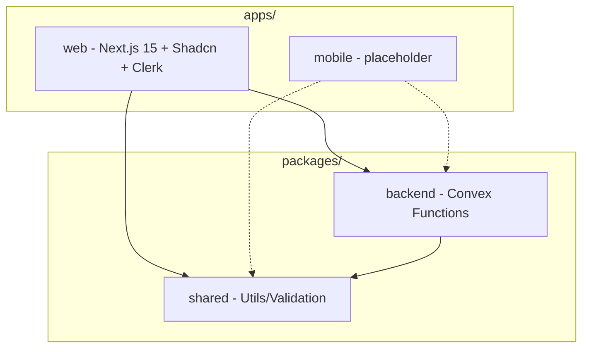

# Bakery Monorepo Setup Plan

## Architecture Overview



---

## Phase 1: Initialize Monorepo Root

Use CLI commands to scaffold the monorepo structure:

```bash
# Initialize pnpm and create workspace config
pnpm init

# Add dev dependencies
pnpm add -D turbo typescript prettier

# Create directory structure
mkdir -p apps/web apps/mobile packages/backend packages/shared/src
```

Create `pnpm-workspace.yaml`:

```yaml
packages:
  - "apps/*"
  - "packages/*"
```

Create `turbo.json` with task pipeline configuration for `dev`, `build`, `lint`, `typecheck`, and `format`.

Create `tsconfig.base.json` (root TypeScript config that packages extend):

```json
{
  "$schema": "https://json.schemastore.org/tsconfig",
  "compilerOptions": {
    "target": "ES2022",
    "lib": ["ES2022", "DOM", "DOM.Iterable"],
    "module": "ESNext",
    "moduleResolution": "bundler",
    "resolveJsonModule": true,
    "isolatedModules": true,
    "esModuleInterop": true,
    "strict": true,
    "skipLibCheck": true,
    "noEmit": true,
    "declaration": true,
    "declarationMap": true
  }
}
```

Create `.prettierrc`:

```json
{
  "semi": true,
  "singleQuote": false,
  "tabWidth": 2,
  "trailingComma": "es5",
  "printWidth": 100
}
```

Create `.prettierignore`:

```
node_modules
.next
dist
convex/_generated
pnpm-lock.yaml
```

---

## Phase 2: Create the Backend Package

```bash
cd packages/backend
pnpm init
pnpm add convex
pnpm add -D typescript
mkdir convex
```

Then manually create:

- `packages/backend/convex/schema.ts` - Database schema (with users table for Clerk)
- `packages/backend/tsconfig.json` - TypeScript config extending root
- Update `packages/backend/package.json` with name `@bakery/backend` and exports for the generated API

---

## Phase 3: Create the Shared Package

```bash
cd packages/shared
pnpm init
pnpm add zod
pnpm add -D typescript
```

Then manually create:

- `packages/shared/src/index.ts` - Main exports
- `packages/shared/src/validation.ts` - Zod schemas for shared validation
- `packages/shared/src/constants.ts` - Shared constants
- `packages/shared/tsconfig.json`
- Update `packages/shared/package.json` with exports

---

## Phase 4: Create Next.js Web App

Use the Next.js CLI for scaffolding:

```bash
cd apps
pnpm create next-app@latest web --typescript --tailwind --eslint --app --src-dir --import-alias "@/*"
```

This creates a fully configured Next.js 15 app with:

- App Router
- TypeScript
- Tailwind CSS
- ESLint

Then add dependencies:

```bash
cd web
pnpm add convex @clerk/nextjs @bakery/backend@workspace:* @bakery/shared@workspace:*
```

---

## Phase 5: Initialize Shadcn UI

```bash
cd apps/web
pnpm dlx shadcn@latest init
```

When prompted, select:

- Style: Default (or New York)
- Base color: Your preference
- CSS variables: Yes

Add some base components:

```bash
pnpm dlx shadcn@latest add button card input label
```

---

## Phase 6: Set Up Clerk Authentication

Create `apps/web/src/app/providers.tsx` with Clerk + Convex integration:

```tsx
"use client";

import { ClerkProvider, useAuth } from "@clerk/nextjs";
import { ConvexProviderWithClerk } from "convex/react-clerk";
import { ConvexReactClient } from "convex/react";
import { ReactNode } from "react";

const convex = new ConvexReactClient(process.env.NEXT_PUBLIC_CONVEX_URL!);

export function Providers({ children }: { children: ReactNode }) {
  return (
    <ClerkProvider>
      <ConvexProviderWithClerk client={convex} useAuth={useAuth}>
        {children}
      </ConvexProviderWithClerk>
    </ClerkProvider>
  );
}
```

Create `apps/web/src/middleware.ts` for Clerk route protection:

```typescript
import { clerkMiddleware } from "@clerk/nextjs/server";

export default clerkMiddleware();

export const config = {
  matcher: ["/((?!.*\\..*|_next).*)", "/", "/(api|trpc)(.*)"],
};
```

Update `apps/web/src/app/layout.tsx` to use Providers.

---

## Phase 7: Root Configuration

Update root `package.json` with workspace scripts:

```json
{
  "scripts": {
    "dev": "turbo dev",
    "build": "turbo build",
    "lint": "turbo lint",
    "format": "prettier --write \"**/*.{ts,tsx,js,jsx,json,md}\"",
    "format:check": "prettier --check \"**/*.{ts,tsx,js,jsx,json,md}\"",
    "convex:dev": "pnpm --filter=@bakery/backend exec convex dev",
    "convex:deploy": "pnpm --filter=@bakery/backend exec convex deploy"
  }
}
```

Create:

- `.gitignore` - Ignore node_modules, .next, .env.local, convex/\_generated
- `.env.example` - Template for environment variables (including Clerk keys)
- `apps/mobile/.gitkeep` - Placeholder for future mobile app

`.env.example` contents:

```bash
# Convex
NEXT_PUBLIC_CONVEX_URL=https://your-project.convex.cloud

# Clerk
NEXT_PUBLIC_CLERK_PUBLISHABLE_KEY=pk_test_xxx
CLERK_SECRET_KEY=sk_test_xxx
```

---

## Phase 8: Initialize Convex Project

```bash
# From packages/backend directory
cd packages/backend
pnpm exec convex dev
```

This will:

1. Prompt you to log in to Convex
2. Create a new project (or link existing)
3. Generate `convex/_generated/` types
4. Start watching for changes

---

## Phase 9: Create Cursor Rules

Create `.cursor/rules/bakery.mdc` with project-specific best practices:

```markdown
---
description: Best practices for the Bakery monorepo
globs: **/*
---

# Bakery Monorepo Guidelines

## Project Structure

- `apps/web` - Next.js 15 app (App Router, Tailwind, Shadcn UI, Clerk auth)
- `apps/mobile` - Expo app (future)
- `packages/backend` - Shared Convex backend (schema, functions, generated types)
- `packages/shared` - Shared utilities, Zod validation, and constants

## Import Conventions

- Import Convex API from `@bakery/backend`: `import { api } from "@bakery/backend"`
- Import shared utilities from `@bakery/shared`: `import { ... } from "@bakery/shared"`
- Import Shadcn components from `@/components/ui`
- Use `@/*` alias for app-internal imports in Next.js

## Convex Best Practices

- All database schema changes go in `packages/backend/convex/schema.ts`
- Convex functions live in `packages/backend/convex/` (e.g., `users.ts`, `orders.ts`)
- Always use the generated `api` object for type-safe function calls
- Run `pnpm convex:dev` from root to start Convex dev server

## Authentication (Clerk)

- Clerk is configured in `apps/web/src/app/providers.tsx`
- Use `useAuth()` from `@clerk/nextjs` for auth state
- Protected routes are handled by `middleware.ts`
- User data syncs to Convex via the users table

## React/Next.js Patterns

- Use `"use client"` directive only when needed (hooks, interactivity)
- Convex hooks (`useQuery`, `useMutation`) require client components
- Keep server components as the default for better performance
- Use Shadcn UI components from `@/components/ui`

## Styling

- Tailwind CSS for utility classes
- Shadcn UI for pre-built components
- Follow the established component patterns in `apps/web/src/components/ui`

## Commands

- `pnpm dev` - Start all dev servers (Turborepo)
- `pnpm build` - Build all packages
- `pnpm format` - Format code with Prettier
- `pnpm convex:dev` - Start Convex dev server only
- `pnpm convex:deploy` - Deploy Convex to production

## Adding New Packages

1. Create directory in `packages/`
2. Run `pnpm init` in the new directory
3. Extend `tsconfig.base.json` in the package's tsconfig
4. Add to consuming apps with `@bakery/package-name@workspace:*`
5. Run `pnpm install` from root

## Environment Variables

- `NEXT_PUBLIC_CONVEX_URL` - Convex deployment URL
- `NEXT_PUBLIC_CLERK_PUBLISHABLE_KEY` - Clerk public key
- `CLERK_SECRET_KEY` - Clerk secret key (server-side only)
- Never commit `.env.local` files
- Use `.env.example` as a template
```

---

## Files Created by CLI vs Manual

| Method | Files |

|--------|-------|

| **CLI** | Root package.json, apps/web/ _(via create-next-app), Shadcn components (via shadcn CLI), packages/_/package.json (via pnpm init) |

| **Manual** | pnpm-workspace.yaml, turbo.json, tsconfig.base.json, .prettierrc, .gitignore, .env.example, schema.ts, providers.tsx, middleware.ts, .cursor/rules/bakery.mdc |

---

## Final Directory Structure

```
bakery/
├── .cursor/
│   └── rules/
│       └── bakery.mdc          # Cursor AI rules
├── apps/
│   ├── web/                    # Next.js (created by CLI)
│   │   ├── src/
│   │   │   ├── app/
│   │   │   │   ├── layout.tsx  # Modified - uses Providers
│   │   │   │   ├── providers.tsx # New - Clerk + Convex
│   │   │   │   └── page.tsx
│   │   │   ├── components/
│   │   │   │   └── ui/         # Shadcn components
│   │   │   │       ├── button.tsx
│   │   │   │       ├── card.tsx
│   │   │   │       └── ...
│   │   │   └── middleware.ts   # Clerk auth middleware
│   │   ├── components.json     # Shadcn config
│   │   ├── package.json
│   │   └── tsconfig.json
│   └── mobile/
│       └── .gitkeep
├── packages/
│   ├── backend/                # Convex backend
│   │   ├── convex/
│   │   │   ├── _generated/     # Auto-generated
│   │   │   └── schema.ts
│   │   ├── package.json        # name: @bakery/backend
│   │   └── tsconfig.json
│   └── shared/
│       ├── src/
│       │   ├── index.ts
│       │   ├── validation.ts   # Zod schemas
│       │   └── constants.ts
│       ├── package.json        # name: @bakery/shared
│       └── tsconfig.json
├── .prettierrc
├── .prettierignore
├── pnpm-workspace.yaml
├── tsconfig.base.json          # Shared TS config
├── turbo.json
├── package.json
├── .gitignore
└── .env.example
```
