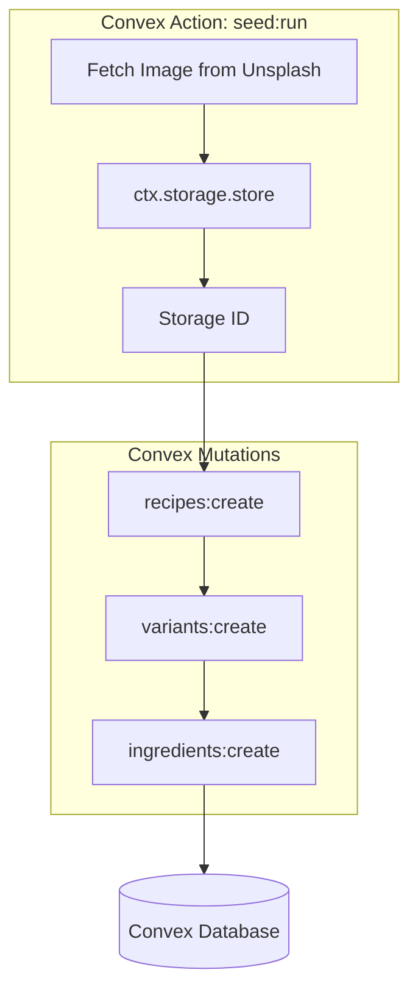

# Seeding and Splash Page Redesign

This plan will move the project from a template "shop" to a functional baking application by establishing the database schema, seeding it with diverse recipes (Bread and Pastries), and implementing interactive tools on the splash page.

## Data Flow: Seeding Process

## Proposed Changes

### 1. Backend: Data Model and API

- Update `packages/backend/convex/schema.ts` to include `recipes`, `variants`, and `ingredients` tables.
- Create `packages/backend/convex/recipes.ts` with queries for `listCommunityRecipes` and `getRecipeWithImages`.
- Create `packages/backend/convex/seed.ts` containing the logic to fetch Unsplash images and populate the database with a mix of Sourdough, Croissants, and Cookies.

### 2. Shared: Business Logic

- Add `calculateBakersPercentage` and `scaleRecipe` helpers to `packages/shared/src/index.ts`.
- Define the `SUBSTITUTION_GUIDE` constant in `packages/shared/src/constants.ts` containing data for common baking swaps.

### 3. Frontend: Splash Page Redesign

- Redesign `apps/web/src/app/page.tsx`:
  - **Hero Section:** Update branding and copy to focus on "Baking Science".
  - **Community Section:** Use a `useQuery` to fetch and display the seeded recipes in a card grid.
  - **Interactive Tools Section:**
    - Build a `BakersMathCalculator` component that allows users to adjust flour amounts and see ingredients update in real-time.
    - Build a `SubstitutionSearch` component for the public guide.
  - **Bake Mode Preview:** A visual teaser for the registered user workflow.

## Key Files to Modify

- `packages/backend/convex/schema.ts`
- `packages/backend/convex/seed.ts` (New)
- `packages/shared/src/index.ts`
- `apps/web/src/app/page.tsx`
